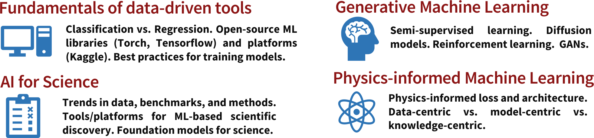

<!-- # Apply now
We invite Computational, Fluid Dynamics, Combustion, or AI/ML researchers worldwide  to join us at this virtual/hybrid workshop by [signing up here!](https://www.eventbrite.com/e/stanford-flame-ai-workshop-2023-tickets-593756701277) -->

# Mission
<!-- To foster a dynamic forum for exchanging ideas, data, methods, and models related to ML techniques for fluid dynamics, turbulence, and environmental flow - fields crucial to the development of energy, climate, wildfire mitigation and safety systems. -->
To foster a dynamic forum for exchanging ideas, cutting-edge data, advanced methods, and models related to ML techniques for fluid dynamics, turbulence, and environmental science - applications crucial to the development of sustainable energy solutions, climate resilience, wildfire mitigation, and safety systems.

# Agenda
1. A **four-week long ML challenge** (involving 1-2 person(s) per team) will be held to tackle ML-challenges in predicting spatio-temporal and dynamical processes in physical sciences, environmental flows, and engineering with open-source data.
- **Prize**: GPU credits, and leading teams will be invited towards a joint publication.
2. **Invite talks and keynote lectures** on cutting-edge trends will be given by AI/ML experts within Stanford, academic guests,
and industry partners from the Greater Silicon Valley ecosystem. Topics include:

# Invited Speakers (In alphabetical order)

Stay tuned for more speaker announcements...

<!-- Stay tuned for the speaker announcements... -->

