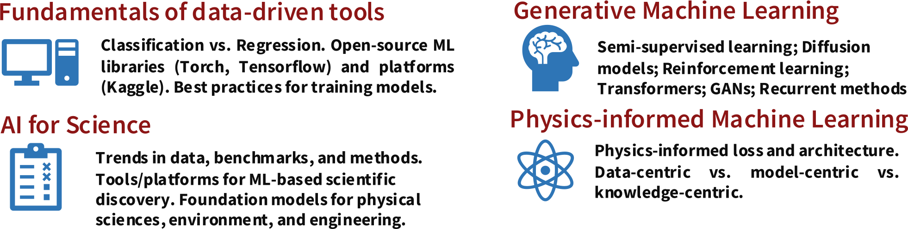

# Apply now
We invite Computational, Fluid Dynamics, Combustion, or AI/ML researchers worldwide  to join us at this virtual/hybrid workshop by [signing up here!](https://www.eventbrite.com/e/stanford-flame-ai-workshop-2023-tickets-593756701277)

# Mission
To foster a dynamic forum for exchanging ideas, data, methods, and models related to ML techniques for fluid dynamics, turbulence, and combustion - fields crucial to the development of energy, propulsion, climate, and safety systems.

# Agenda
1. A **10-day-long ML challenge** (involving 1-2 person(s) per team) will be held to tackle generative modeling in fluid dynamics/turbulence with open-source data. **Prize**: GPU credits, and leading teams will be invited towards a joint publication.
2. **Daily talks** on cutting-edge trends will be given by AI/ML experts within Stanford, academic guests,
and industry partners from the Greater Silicon Valley ecosystem. Topics include:

# Invited Speakers (In alphabetical order)



Stay tuned for more speaker announcements...

