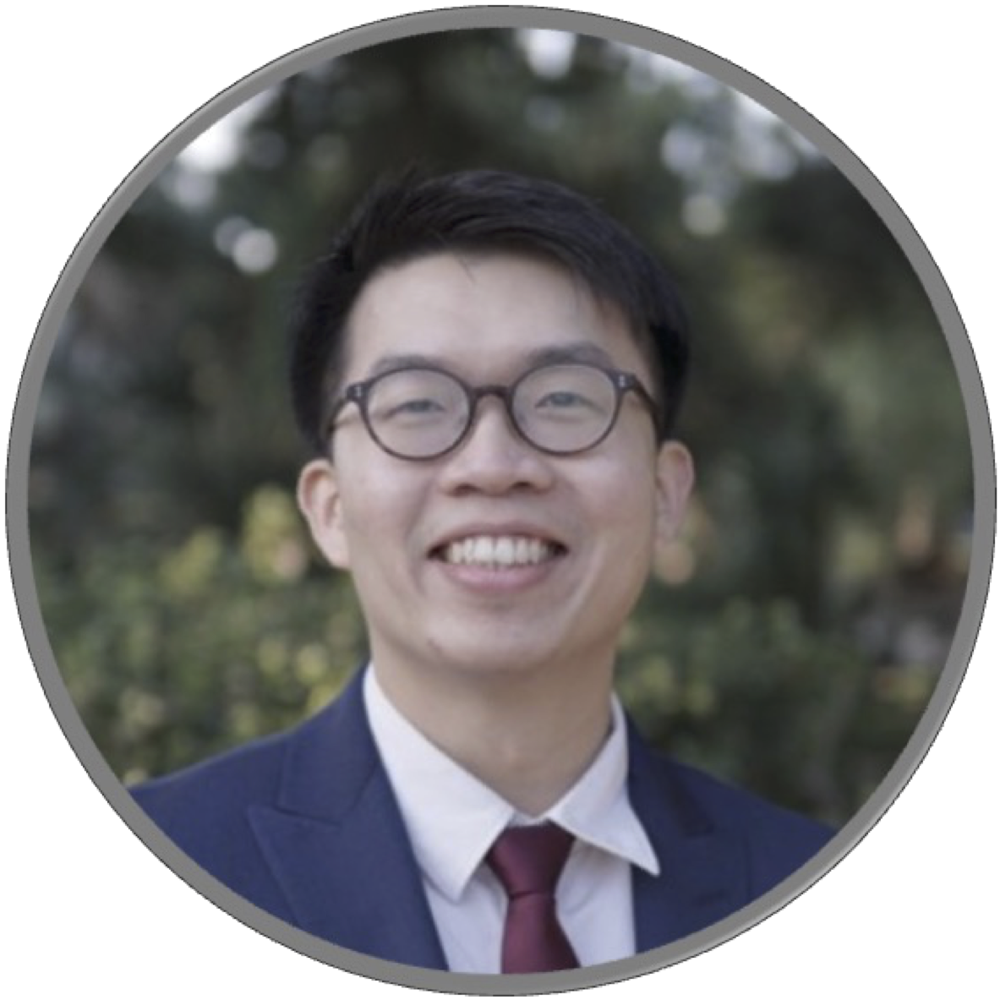
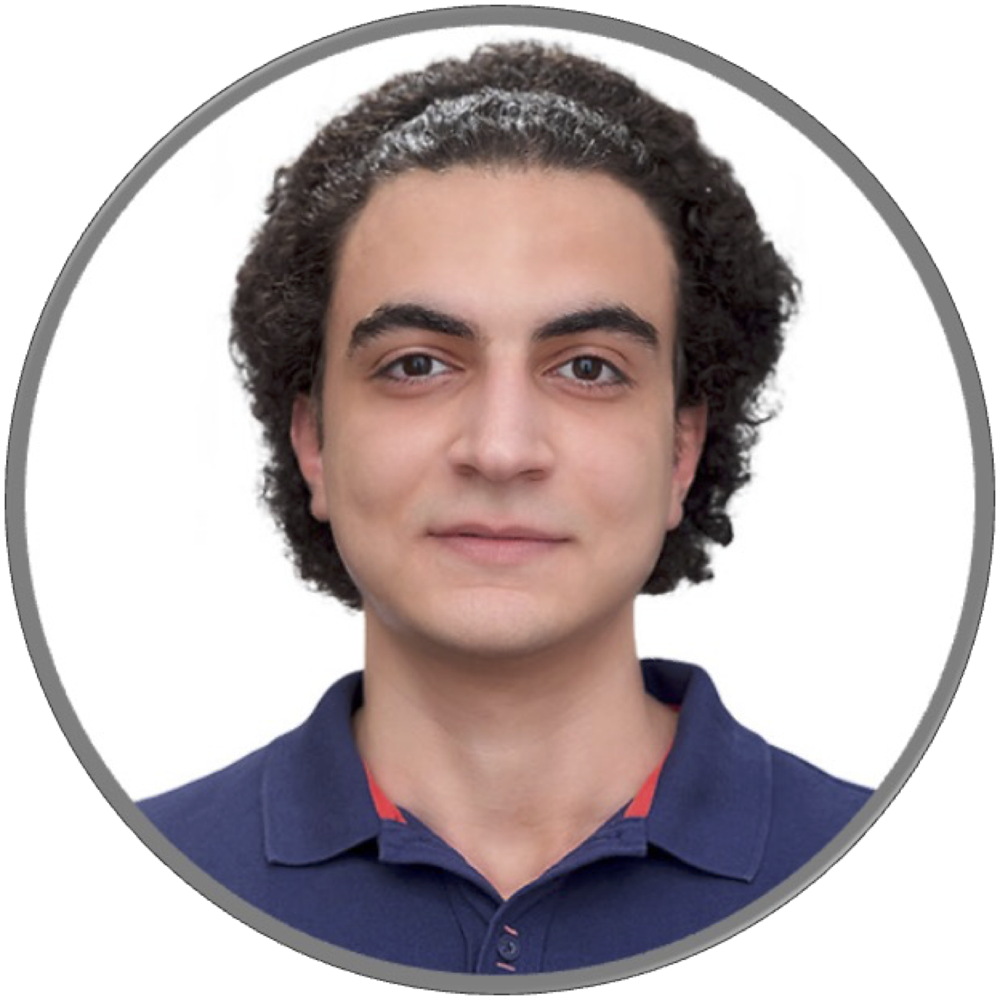

## Organizing Committee

[Prof. Matthias Ihme](https://web.stanford.edu/group/ihmegroup/cgi-bin/MatthiasIhme/people/matthias-ihme/) (Stanford University, SLAC National Accelerator Laboratory)

[Wai Tong Chung](https://waitong94.github.io/) (Stanford University, Stanford Institute for Human-Centered AI)

[Pushan Sharma](linkedin.com/in/pushan-sharma-0b327588/) (Stanford University)

[Bassem Akoush](https://www.linkedin.com/in/bassem-akoush/) (Stanford University)

<!-- 

<figure style="margin-right:0px">
  
  <figcaption>Matthias Ihme</figcaption>
</figure>
<figure>
  
  <figcaption>Wai Tong Chung</figcaption>
</figure>
<figure>
  
  <figcaption>Pushan Sharma</figcaption>
</figure>
<figure>
  
  <figcaption>Bassem Akoush</figcaption>
</figure>

 -->

<!-- [Return to Home](./) -->
